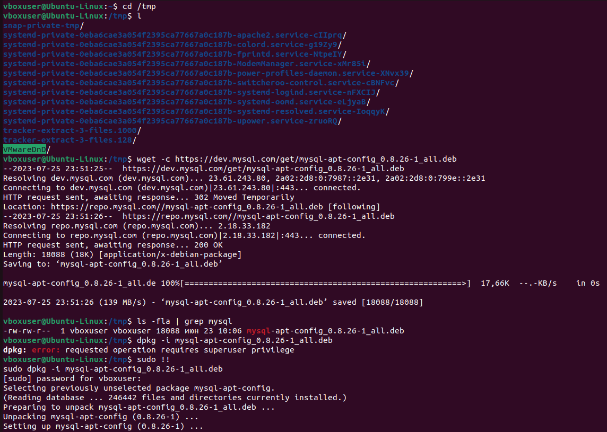
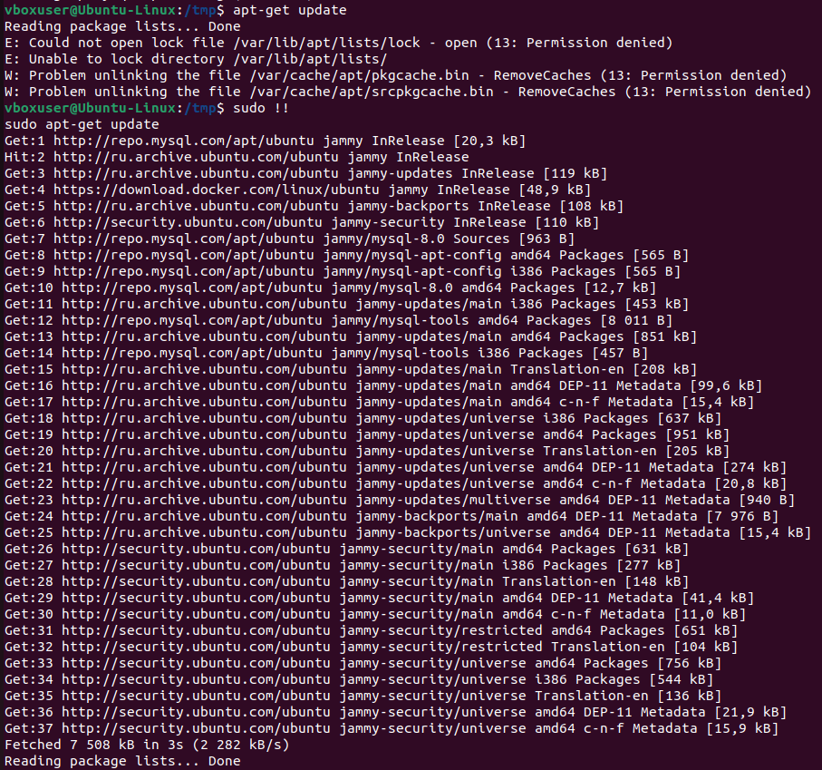
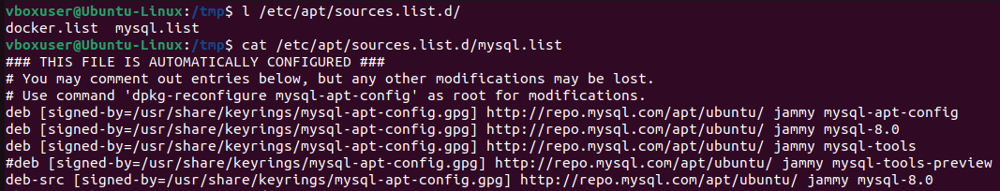
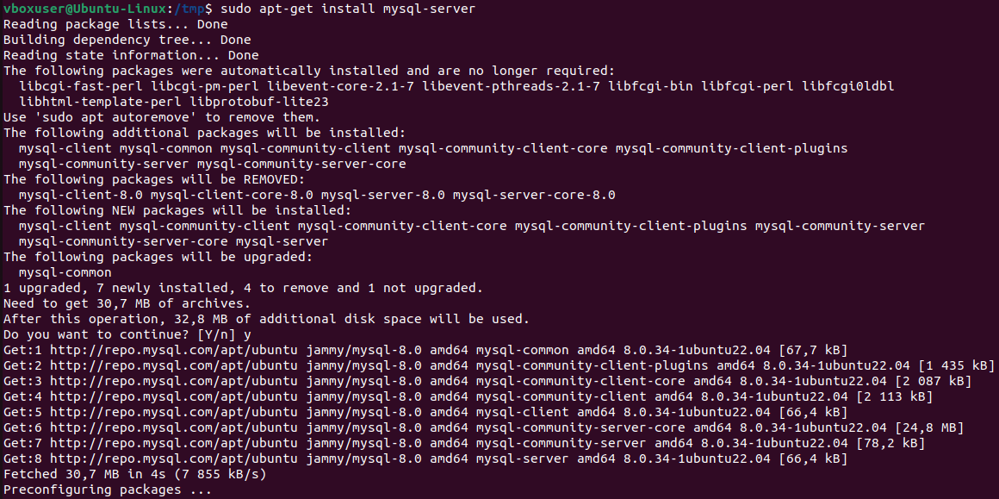
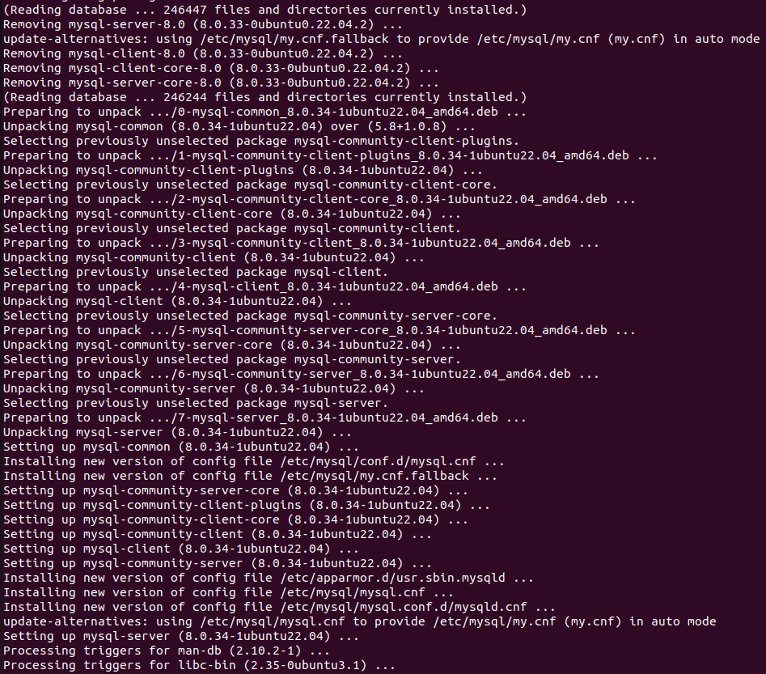
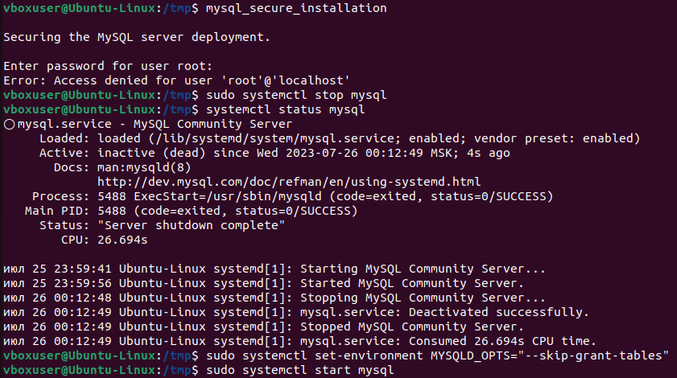
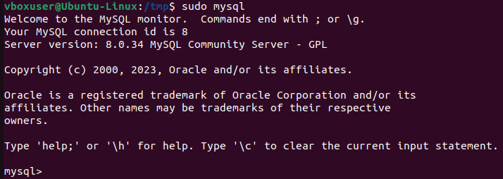
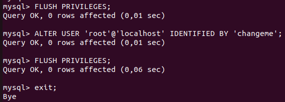
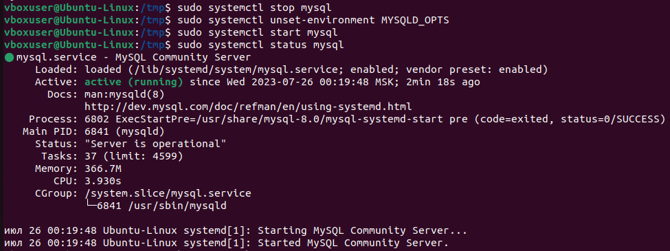

# Решение задания:
1. Используя команду **cat** в терминале операционной системы Linux, создать два файла 'Домашние животные' (заполнив файл Собаками, Кошками, Хомяками) и 'Вьючные животные' (заполнив файл Лошадьми, Верблюдами и Ослами), а затем объединить их. Просмотреть содержимое созданного файла. Переименовать файл, дав ему новое имя (Друзья человека).
   * cd GBTest/
   * cat > 'Домашние животные'
     * Собаки,
     * Кошки,
     * Хомяки.
     * Ctrl+D
   * cat > 'Вьючные животные'
     * Лошади,
     * Верблюды,
     * Ослы.
     * Ctrl+D
   * cat 'Домашние животные' 'Вьючные животные' > 'Животные'
   * mv 'Животные' 'Друзья человека'
   * cat 'Друзья человека'
2. Создать директорию, переместить файл туда.
   * mkdir Animals
   * mv 'Друзья человека' ./Animals/
3. Подключить дополнительный репозиторий MySQL. Установить любой пакет из этого репозитория.
   * https://dev.mysql.com/downloads/repo/apt/
   * cd /tmp
     * wget -c https://dev.mysql.com/get/mysql-apt-config_0.8.26-1_all.deb
     * ls -fla | grep mysql
     * sudo dpkg -i mysql-apt-config_0.8.26-1_all.deb
     * 
   * sudo apt-get update
     * 
   * l /etc/apt/sources.list.d/
     * cat /etc/apt/sources.list.d/mysql.list
     * 
   * sudo apt-get install mysql-server
     * 
     * 
   * mysql_secure_installation
     * sudo systemctl stop mysql
     * systemctl status mysql
     * sudo systemctl set-environment MYSQLD_OPTS="--skip-grant-tables"
     * sudo systemctl start mysql
     * 
   * sudo mysql
     * 
     * 
   * sudo systemctl stop mysql
     * sudo systemctl unset-environment MYSQLD_OPTS
     * sudo systemctl start mysql
     * sudo systemctl status mysql
     * 
4. Установить и удалить deb-пакет с помощью dpkg.
   * sudo dpkg --list
   * 
5. Выложить историю команд в терминале ubuntu.
   * history >> GBTest/history.txt
6. Нарисовать диаграмму, в которой есть класс родительский класс, домашние животные и вьючные животные, в составы которых в случае домашних животных войдут классы: Собаки, Кошки, Хомяки, а в класс вьючные животные войдут: Лошади, Верблюды и Ослы).
    * 
7. В подключённом MySQL репозитории создать базу данных “Друзья человека”.
8. Создать таблицы с иерархией из диаграммы в БД.
9. Заполнить низкоуровневые таблицы именами(животных), командами которые они выполняют и датами рождения.
10. Удалив из таблицы Верблюдов, т.к. верблюдов решили перевезти в другой питомник на зимовку. Объединить таблицы Лошади, и Ослы в одну таблицу.
11. Создать новую таблицу “Молодые животные” в которую попадут все животные старше 1 года, но младше 3 лет и в отдельном столбце с точностью до месяца подсчитать возраст животных в новой таблице.
12. Объединить все таблицы в одну, при этом сохраняя поля, указывающие на прошлую принадлежность к старым таблицам.
13. Создать класс с Инкапсуляцией методов и наследованием по диаграмме.
14. Написать программу, имитирующую работу реестра домашних животных.
### В программе должен быть реализован следующий функционал:
    14.1 Завести новое животное
    14.2 определять животное в правильный класс
    14.3 увидеть список команд, которое выполняет животное
    14.4 обучить животное новым командам
    14.5 Реализовать навигацию по меню
15. Создайте класс Счетчик, у которого есть метод **add()**, увеличивающий̆ значение внутренней̆ **int** переменной̆ на 1 при нажатии “Завести новое животное” Сделайте так, чтобы с объектом такого типа можно было работать в блоке try-with-resources. Нужно бросить исключение, если работа с объектом типа счетчик была не в ресурсном try и/или ресурс остался открыт. Значение считать в ресурсе try, если при заведения животного заполнены все поля.