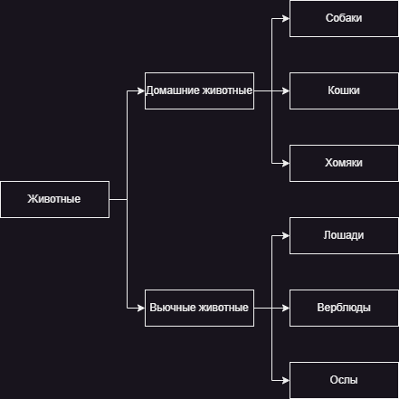

# Решение задания:
---
---
1. Используя команду **cat** в терминале операционной системы Linux, создать два файла 'Домашние животные' (заполнив файл Собаками, Кошками, Хомяками) и 'Вьючные животные' (заполнив файл Лошадьми, Верблюдами и Ослами), а затем объединить их. Просмотреть содержимое созданного файла. Переименовать файл, дав ему новое имя (Друзья человека).
   * cd GBTest/
   * cat > 'Домашние животные'
     * Собаки,
     * Кошки,
     * Хомяки.
     * Ctrl+D
   * cat > 'Вьючные животные'
     * Лошади,
     * Верблюды,
     * Ослы.
     * Ctrl+D
   * cat 'Домашние животные' 'Вьючные животные' > 'Животные'
   * mv 'Животные' 'Друзья человека'
   * cat 'Друзья человека'
---
2. Создать директорию, переместить файл туда.
   * mkdir Animals
   * mv 'Друзья человека' ./Animals/
---
3. Подключить дополнительный репозиторий MySQL. Установить любой пакет из этого репозитория.
   * https://dev.mysql.com/downloads/repo/apt/
   * cd /tmp
     * wget -c https://dev.mysql.com/get/mysql-apt-config_0.8.26-1_all.deb
     * ls -fla | grep mysql
     * sudo dpkg -i mysql-apt-config_0.8.26-1_all.deb
     * 
   * sudo apt-get update
     * 
   * l /etc/apt/sources.list.d/
     * cat /etc/apt/sources.list.d/mysql.list
     * 
   * sudo apt-get install mysql-server
     * 
     * 
   * mysql_secure_installation
     * sudo systemctl stop mysql
     * systemctl status mysql
     * sudo systemctl set-environment MYSQLD_OPTS="--skip-grant-tables"
     * sudo systemctl start mysql
     * 
   * sudo mysql
     * 
     * 
   * sudo systemctl stop mysql
     * sudo systemctl unset-environment MYSQLD_OPTS
     * sudo systemctl start mysql
     * sudo systemctl status mysql
     * 
---
4. Установить и удалить deb-пакет с помощью dpkg.
   * sudo dpkg --list
   * sudo dpkg -i man-db
   * sudo dpkg -r man-db
---
5. Выложить историю команд в терминале ubuntu.
   * history >> GBTest/history.txt
---
6. Нарисовать диаграмму, в которой есть класс родительский класс, домашние животные и вьючные животные, в составы которых в случае домашних животных войдут классы: Собаки, Кошки, Хомяки, а в класс вьючные животные войдут: Лошади, Верблюды и Ослы).
    * 
---
7. В подключённом MySQL репозитории создать базу данных “Друзья человека”.
   * [Создание БД](Script/Животные_CREATE.sql)
   * CREATE DATABASE Друзья_человека;\
     USE Друзья_человека;
---
8. Создать таблицы с иерархией из диаграммы в БД.
   * [Создание Таблиц](Script/Животные_CREATE.sql)
   * **Первый уровень.**\
   CREATE TABLE Животные (\
   id INT NOT NULL AUTO_INCREMENT,\
   имя VARCHAR(50) NOT NULL,\
   команды TEXT DEFAULT NULL,\
   дата_рождения DATE DEFAULT NULL,\
   вид VARCHAR(50) DEFAULT NULL,\
   PRIMARY KEY (id)\
   );
   
   * **Второй уровень.**\
   CREATE TABLE Домашние_животные (\
   id INT NOT NULL AUTO_INCREMENT,\
   имя VARCHAR(50) NOT NULL,\
   команды TEXT DEFAULT NULL,\
   дата_рождения DATE DEFAULT NULL,\
   вид VARCHAR(50) DEFAULT NULL,\
   PRIMARY KEY (id)\
   );\
   \
   CREATE TABLE Вьючные_животные (\
   id INT NOT NULL AUTO_INCREMENT,\
   имя VARCHAR(50) NOT NULL,\
   команды TEXT DEFAULT NULL,\
   дата_рождения DATE DEFAULT NULL,\
   вид VARCHAR(50) DEFAULT NULL,\
   PRIMARY KEY (id)\
   );
   
   * **Третий уровень.**\
   **Домашние животные.**\
   CREATE TABLE Собаки (\
   id INT NOT NULL AUTO_INCREMENT,\
   имя VARCHAR(50) NOT NULL,\
   команды TEXT DEFAULT NULL,\
   дата_рождения DATE DEFAULT NULL,\
   вид VARCHAR(50) DEFAULT NULL,\
   PRIMARY KEY (id)\
   );\
   \
   CREATE TABLE Кошки (\
   id INT NOT NULL AUTO_INCREMENT,\
   имя VARCHAR(50) NOT NULL,\
   команды TEXT DEFAULT NULL,\
   дата_рождения DATE DEFAULT NULL,\
   вид VARCHAR(50) DEFAULT NULL,\
   PRIMARY KEY (id)\
   );\
   \
   CREATE TABLE Хомяки (\
   id INT NOT NULL AUTO_INCREMENT,\
   имя VARCHAR(50) NOT NULL,\
   команды TEXT DEFAULT NULL,\
   дата_рождения DATE DEFAULT NULL,\
   вид VARCHAR(50) DEFAULT NULL,\
   PRIMARY KEY (id)\
   );\
   \
   **Вьючные животные.**\
   CREATE TABLE Лошади (\
   id INT NOT NULL AUTO_INCREMENT,\
   имя VARCHAR(50) NOT NULL,\
   команды TEXT DEFAULT NULL,\
   дата_рождения DATE DEFAULT NULL,\
   вид VARCHAR(50) DEFAULT NULL,\
   PRIMARY KEY (id)\
   );\
   \
   CREATE TABLE Верблюды (\
   id INT NOT NULL AUTO_INCREMENT,\
   имя VARCHAR(50) NOT NULL,\
   команды TEXT DEFAULT NULL,\
   дата_рождения DATE DEFAULT NULL,\
   вид VARCHAR(50) DEFAULT NULL,\
   PRIMARY KEY (id)\
   );\
   \
   CREATE TABLE Ослы (\
   id INT NOT NULL AUTO_INCREMENT,\
   имя VARCHAR(50) NOT NULL,\
   команды TEXT DEFAULT NULL,\
   дата_рождения DATE DEFAULT NULL,\
   вид VARCHAR(50) DEFAULT NULL,\
   PRIMARY KEY (id)\
   );
---
9. Заполнить низкоуровневые таблицы именами(животных), командами которые они выполняют и датами рождения.
    * [Заполнение Низкоуровневых Таблиц](Script/Животные_CREATE.sql)
      * **Домашние животные.**\
   INSERT INTO Собаки (имя, команды, дата_рождения, вид)\
   VALUES ('Джош', 'Сидеть, Лежать, Голос', '2023-06-25', 'Собака'),\
   ('Черри', 'Боевой пёс', '2001-01-01', 'Собака'),\
   ('Малыш', 'Цирковые трюки', '2013-05-17', 'Собака');\
   \
   INSERT INTO Кошки (имя, команды, дата_рождения, вид)\
   VALUES ('Персик', 'Широкую на широкую', '2003-03-12', 'Кошка'),\
   ('Рыжий', 'Бросай курить', '2013-01-07', 'Кошка'),\
   ('Зорька', 'Брысь', '2001-08-20', 'Кошка');\
   \
   INSERT INTO Хомяки (имя, дата_рождения, вид)\
   VALUES ('Чума', '2021-06-17', 'Хомяк'),\
   ('Мауи', '2011-11-05', 'Хомяк'),\
   ('Цветочек', '2018-05-23', 'Хомяк');
   
      * **Вьючные животные.**\
   INSERT INTO Лошади (имя, команды, дата_рождения, вид)\
   VALUES ('Зорро', 'Шагай, Трот, Галоп, Вертикаль, Поворот, Стоять', '2004-09-11', 'Лошадь'),\
   ('Амур', 'Цирковой конь', '2020-12-31', 'Лошадь'),\
   ('Бриз', 'Оп-оп-оп', '2007-07-07', 'Лошадь');\
   \
   INSERT INTO Верблюды (имя, команды, дата_рождения, вид)\
   VALUES ('Марго', 'Идти, Пастись', '2013-02-27', 'Верблюд'),\
   ('Амир', 'Идти на зов, Нести грузы', '2013-06-13', 'Верблюд'),\
   ('Сахар', 'Пастись', '2021-10-20', 'Верблюд');\
   \
   INSERT INTO Ослы (имя, команды, дата_рождения, вид)\
   VALUES ('Иван', 'Вперёд, Назад, Голос', '2023-08-06', 'Осёл'),\
   ('Мурзик', 'Стой', '2023-03-12', 'Осёл'),\
   ('Булыжник', 'Исследование завершено', '2021-02-12', 'Осёл');
    
    * [Заполнение Таблиц Верхнего Уровня](Script/Животные_INSERT.sql)
      * INSERT INTO Домашние_животные ( Имя, Команды, Дата_рождения, Вид)\
      SELECT Имя, Команды, Дата_рождения, Вид\
      FROM (SELECT Имя, Команды, Дата_рождения, Вид\
      FROM Собаки\
      UNION ALL\
      SELECT Имя, Команды, Дата_рождения, Вид\
      FROM Кошки\
      UNION ALL\
      SELECT Имя, Команды, Дата_рождения, Вид\
      FROM Хомяки) AS Апдейт;\
      \
      INSERT INTO Вьючные_животные ( Имя, Команды, Дата_рождения, Вид)\
      SELECT Имя, Команды, Дата_рождения, Вид\
      FROM (SELECT Имя, Команды, Дата_рождения, Вид\
      FROM Лошади\
      UNION ALL\
      SELECT Имя, Команды, Дата_рождения, Вид\
      FROM Верблюды\
      UNION ALL\
      SELECT Имя, Команды, Дата_рождения, Вид\
      FROM Ослы) AS Апдейт;\
      \
      INSERT INTO Животные ( Имя, Команды, Дата_рождения, Вид)\
      SELECT Имя, Команды, Дата_рождения, Вид\
      FROM (SELECT Имя, Команды, Дата_рождения, Вид\
      FROM Домашние_животные\
      UNION ALL\
      SELECT Имя, Команды, Дата_рождения, Вид\
      FROM Вьючные_животные) AS Апдейт;
---
10. Удалив из таблицы Верблюдов, т.к. верблюдов решили перевезти в другой питомник на зимовку. Объединить таблицы Лошади, и Ослы в одну таблицу.
    * [Удаление Верблюдов Из Таблиц Животные и Вьючные_животные](Script/Животные_DELETE.sql)
    * USE Друзья_человека;\
      SET SQL_SAFE_UPDATES = 0;\
      DELETE FROM Вьючные_животные WHERE Вид='Верблюд';\
      DELETE FROM Животные WHERE Вид = 'Верблюд';\
      SET SQL_SAFE_UPDATES = 1;
---
11. Создать новую таблицу “Молодые животные” в которую попадут все животные старше 1 года, но младше 3 лет и в отдельном столбце с точностью до месяца подсчитать возраст животных в новой таблице.
    * [Молодые_животные](Script/Животные_YOUNG.sql)
    * CREATE TABLE Молодые_животные AS\
      SELECT *,\
      CONCAT(TIMESTAMPDIFF(YEAR, Дата_рождения, CURDATE()) - IF(EXTRACT(MONTH FROM Дата_рождения) > EXTRACT(MONTH FROM CURDATE()), 1, 0), ' лет ',\
      IF(EXTRACT(MONTH FROM Дата_рождения) > EXTRACT(MONTH FROM CURDATE()), EXTRACT(MONTH FROM CURDATE()) + 12 - EXTRACT(MONTH FROM Дата_рождения), EXTRACT(MONTH FROM CURDATE()) - EXTRACT(MONTH FROM Дата_рождения)), ' месяцев') AS Возраст\
      FROM Животные\
      WHERE Дата_рождения <= DATE_SUB(CURDATE(), INTERVAL 1 YEAR)\
      AND Дата_рождения > DATE_SUB(CURDATE(), INTERVAL 3 YEAR);
---
12. Объединить все таблицы в одну, при этом сохраняя поля, указывающие на прошлую принадлежность к старым таблицам.
    * [Объединение](Script/Животные_UNION.sql)
    * SELECT 'Собаки' AS Принадлежность, Имя, Команды, Дата_рождения FROM Собаки\
      UNION ALL\
      SELECT 'Кошки', Имя, Команды, Дата_рождения FROM Кошки\
      UNION ALL\
      SELECT 'Хомяки', Имя, Команды, Дата_рождения FROM Хомяки\
      UNION ALL\
      SELECT 'Лошади', Имя, Команды, Дата_рождения FROM Лошади\
      UNION ALL\
      SELECT 'Верблюды', Имя, Команды, Дата_рождения FROM Верблюды\
      UNION ALL\
      SELECT 'Ослы', Имя, Команды, Дата_рождения FROM Ослы;
---
13. Создать класс с Инкапсуляцией методов и наследованием по диаграмме.
14. Написать программу, имитирующую работу реестра домашних животных.
### В программе должен быть реализован следующий функционал:
    14.1 Завести новое животное
    14.2 определять животное в правильный класс
    14.3 увидеть список команд, которое выполняет животное
    14.4 обучить животное новым командам
    14.5 Реализовать навигацию по меню
15. Создайте класс Счётчик, у которого есть метод **add()**, увеличивающий̆ значение внутренней̆ **int** переменной̆ на 1 при нажатии “Завести новое животное” Сделайте так, чтобы с объектом такого типа можно было работать в блоке try-with-resources. Нужно бросить исключение, если работа с объектом типа счетчик была не в ресурсном try и/или ресурс остался открыт. Значение считать в ресурсе try, если при заведения животного заполнены все поля.